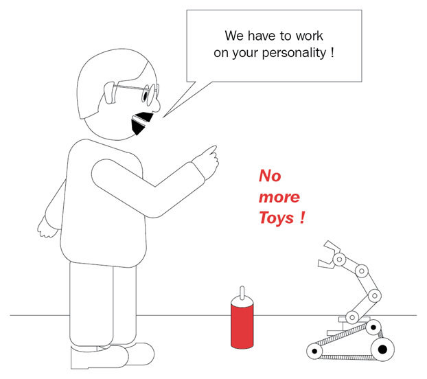

# 9.3 Что такое искусственная личность?

Голливуд и киноиндустрия создали несколько очень запоминающихся роботов. Подумайте о R2D2 и C3PO, о Лореле и Харди от мира научной фантастики. Что вам больше всего нравится в этих двух? Может быть их личности? Задумайтесь об этом на секунду. Хотя R2D2 это, по сути, корзина для мусора с куполообразной головой и без лица, он имеет определенную индивидуальность. Вы описываете его как энергичного или упрямого. Сайт Роботы и Андроиды \([http://www.robots-and-androids.com/R2D2.html](http://www.robots-and-androids.com/R2D2.html)\) описал его так:

_«Дроид показан как очень смелый, непоколебимый в преданности и немного упрямый. Он никогда не отступает от миссии, даже когда шансы кажутся сложенными против него. Его личность часто контрастирует с личностью \[C3PO\], который суетлив и робок.»_

Это довольно впечатляюще для робота, который не говорит ни слова и общается с помощью звуковых сигналов и свистов.

Какие еще роботы из фильмов произвели на вас впечатление? Конечно, WALL-E, очаровательный робот, уплотняющий мусор, из одноименного фильма. WALL-E так же имел небольшой словарный запас, состоящий только из его имени, что очень похоже на покемона. WALL-E проявлял много эмоций и даже развил хобби - сбор и ремонт старого мусора. Вы можете также вспомнить M-O, крошечного, навязчивого робота-уборщика, который раздражается из-за всей грязи, которую приносит WALL-E.

Итак, одна вещь, которую мы могли бы сделать как создатели и дизайнеры робототехники, это вдохнуть в нашего робота какого-то рода индивидуальность. Это преимущественно тем, что позволит людям лучше связаться с роботом на чувственном уровне. Также это создает ложное впечатление, будто робот намного умнее и способен на большее, чем есть на самом деле. Это дает преимущество в том, что делает робота более притягательным и интересным.

Из примеров, данных нам R2D2 и WALL-E, мы также можем сделать вывод, что лучше меньше, да лучше, когда дело доходит до общения - нам нужны не просто слова, но и язык тела и звук. 

В этом разделе мы собираемся разработать искусственную личность для наших роботов. Хотя мы не можем придать роботу настоящие эмоции или чувства, как бы вы не определили эти понятия, что мы можем сделать, так это создать симуляцию личности, которая обеспечит убедительную иллюзию. Я думаю, что это значимое упражнение, потому что нынешние условия в области робототехники диктуют наличие какой-то индивидуальности и непротиворечивого поведения от робототехники, которая взаимодействует с людьми.

В настоящее время в этой области ведется много работы по оказанию цифровой личной помощи, например, Сири от Apple и Алекса от Google. Обратите внимание, что эти роботы, или искусственный интеллект, имеют различные имена и голоса. Мне кажется, что они очень схожи по характеру и возможностям. Есть некоторая разница, когда вы задаете Сири или Алексе личный вопрос, например, сколько им лет \(Сири значительно старше Алексы\).

В этой главе мы собираемся взять инструменты из науки симуляции - в частности, конечный автомат и анализ Монте-Карло - и использовать их, чтобы сформировать модель личности для Тинмана, робота. У нас уже есть довольно мощный инструмент - в речевой системе Майкрофта мы ранее рассказывали шутки про “тук-тук”. Мы будем расширять Майкрофт за счет некоторых новых навыков и возможностей, а также разрабатывать кибернетические эмоции, как для нашего робота, так и для мнения робота о том, что мы, люди, чувствуем.

Я хочу подчеркнуть, что мы симулируем эмоции, а не создаем эмоционального робота. Наша симуляция имеет то же сходство с реальными эмоциями, что и авиасимулятор со спейс шаттлом - оба предоставляют одинаковую информацию, но спейс шаттл облетает Землю за 90 минут, а авиасимулятор никогда не двигается.

